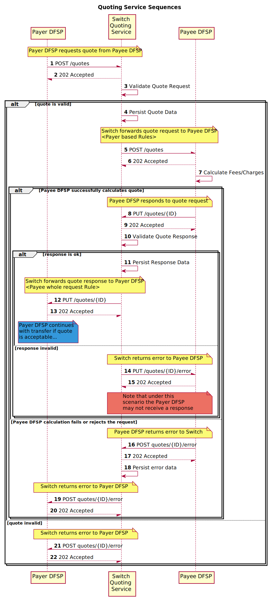

# quoting-service-api-adapter

Swagger api [location](./config/swagger.json)

# Updating dependencies

```
cd src/
npm run-script package-lock
```



* [Quoting Service Sequence diagram](docs/quotingServiceSequences.puml)

# Testing

Follow the README instructions to run and set up the mysql container from the central-ledger
repo. Then run the central-ledger-init container, followed by the quoting-service-init container.
Now you're ready to run the quoting service as follows.

```
cd src/
npm run-script build
npm run-script run
curl localhost:3000
```
